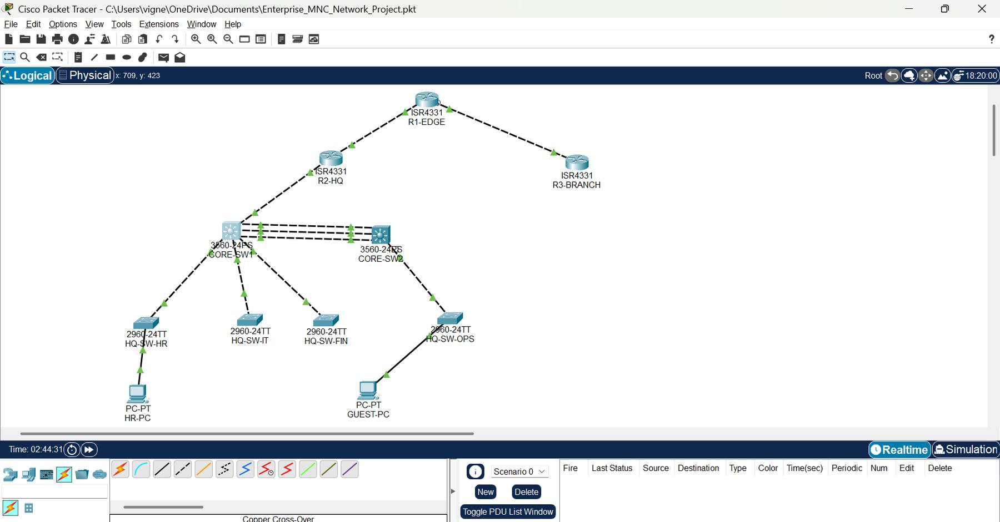
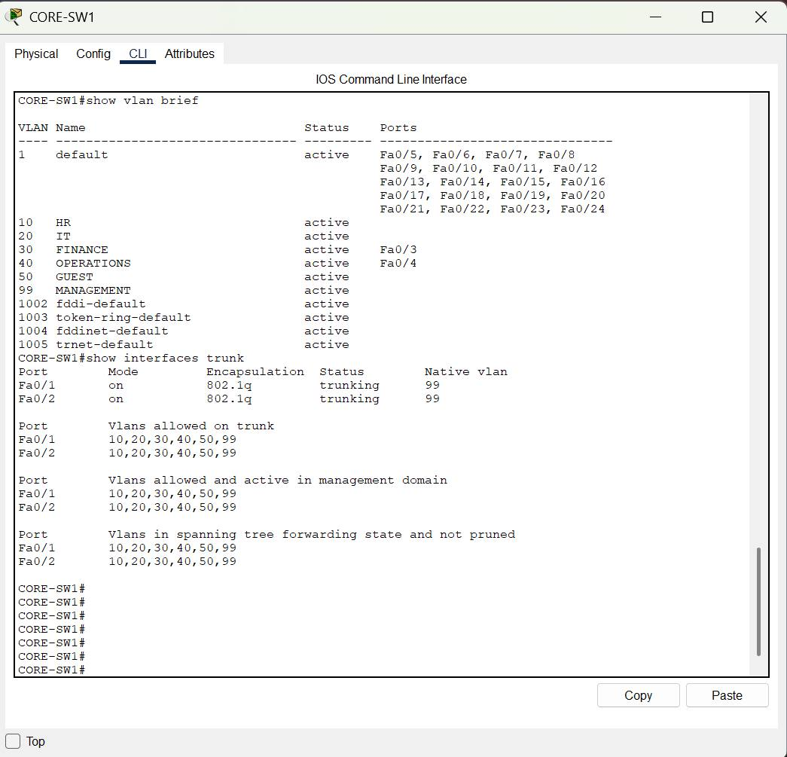
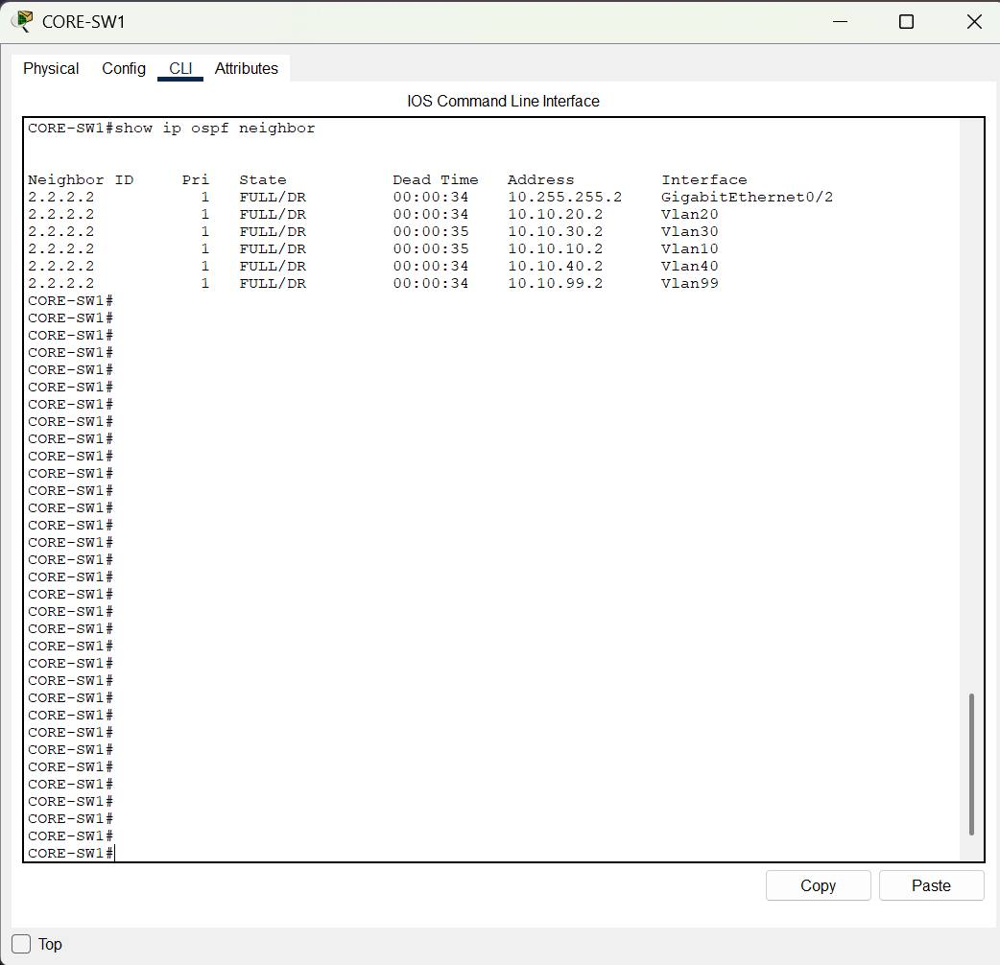
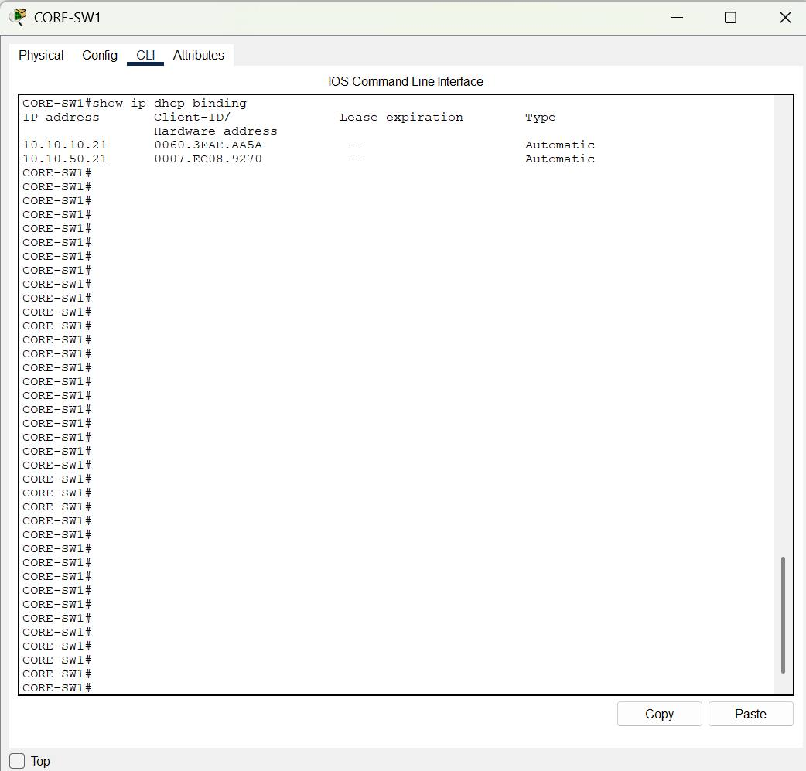
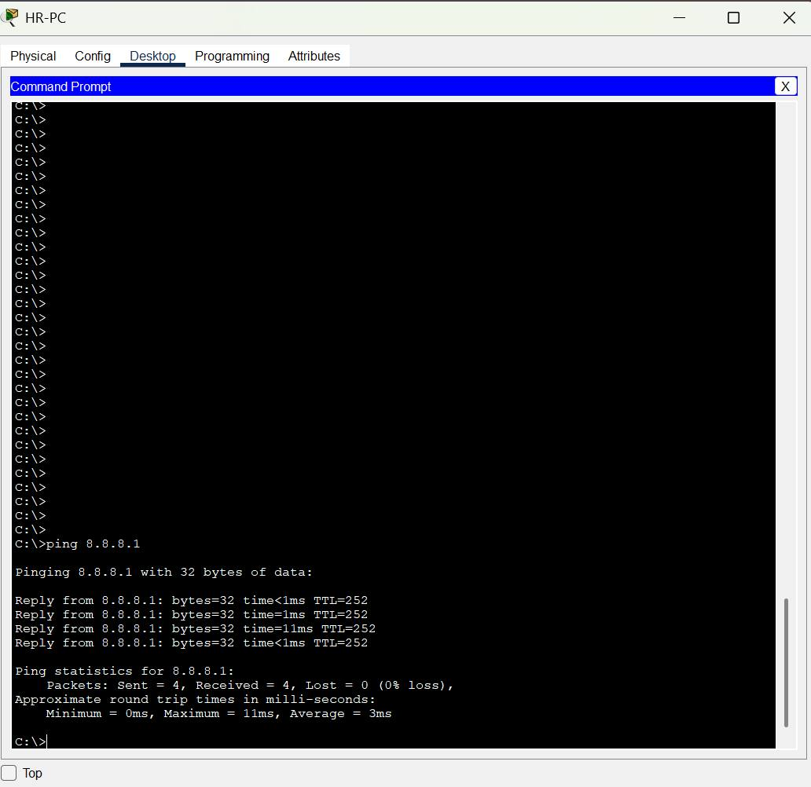
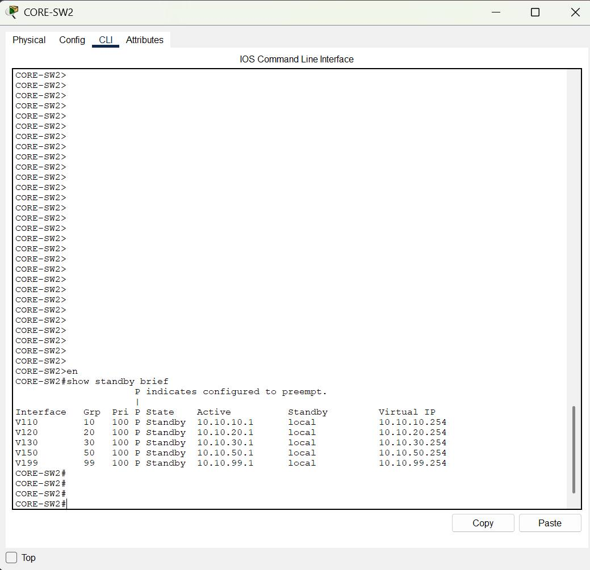
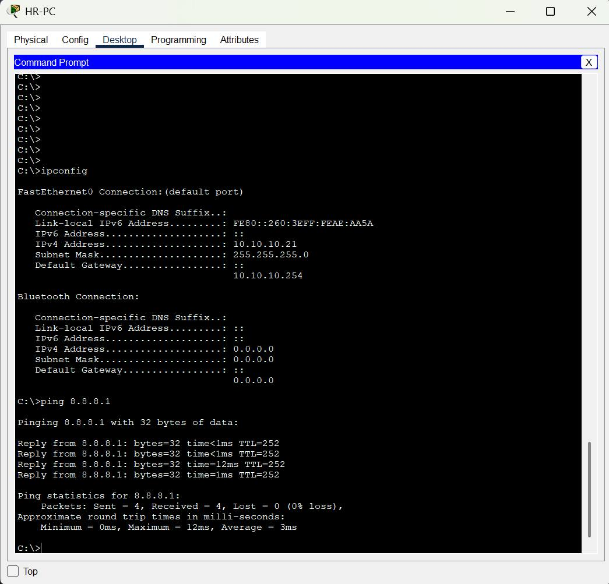
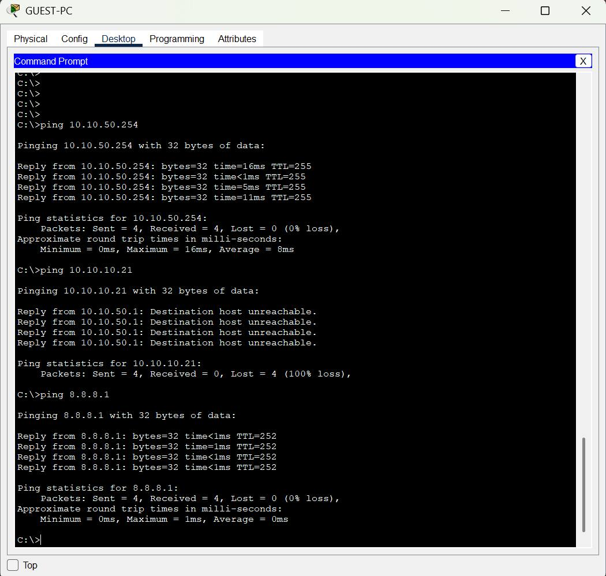
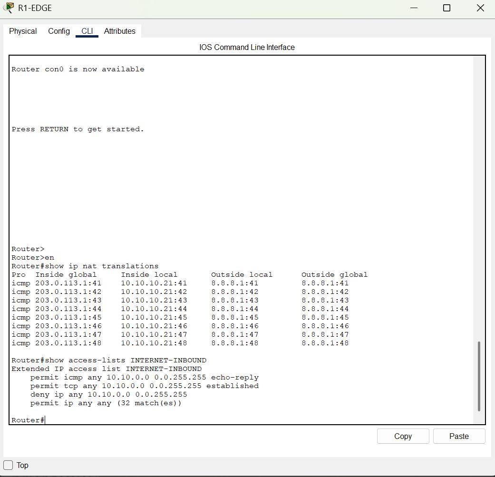

# Enterprise Network — Cisco Packet Tracer

A multi-department enterprise network designed and simulated in Cisco Packet Tracer, combining Layer 2 segmentation, Layer 3 routing, gateway redundancy, network services, NAT/PAT, and edge ACL security.

## Overview

This project models an enterprise HQ network with two multilayer core switches, departmental access switches, an HQ router, an edge router, and a simulated external network.

The design separates departments into dedicated VLANs and uses Layer 3 SVIs, OSPF, HSRP, DHCP, STP, NAT/PAT, and extended ACLs to provide scalable connectivity and controlled access.

## Network Architecture



## VLAN Design

| VLAN | Department | Network | Gateway |
|---:|---|---|---|
| 10 | HR | 10.10.10.0/24 | 10.10.10.254 |
| 20 | IT | 10.10.20.0/24 | 10.10.20.254 |
| 30 | Finance | 10.10.30.0/24 | 10.10.30.254 |
| 40 | Operations | 10.10.40.0/24 | 10.10.40.254 |
| 50 | Guest | 10.10.50.0/24 | 10.10.50.254 |
| 99 | Management | 10.10.99.0/24 | 10.10.99.254 |

## Implemented Features

- Departmental VLAN segmentation
- 802.1Q trunking
- Inter-VLAN routing using multilayer switches and SVIs
- STP loop prevention
- OSPF dynamic routing
- HSRP first-hop gateway redundancy
- DHCP for enterprise and Guest clients
- Guest VLAN isolation using extended ACL policy
- NAT/PAT at the network edge
- Extended ACL filtering on the Internet-facing interface
- Simulated external network for end-to-end testing

## Validation

### VLANs and Trunking



### OSPF



### HSRP



### DHCP



### NAT/PAT



### End-to-End Connectivity



### Guest Security



Guest clients can reach their own gateway and the simulated external network while access to the internal HR network is blocked.

### Edge Security



## Test Highlights

- HR client obtained `10.10.10.21` through DHCP.
- Guest client obtained `10.10.50.21` through DHCP.
- HR reached its gateway and another department gateway successfully.
- HR and Guest clients reached the simulated external host `8.8.8.1`.
- Guest access to the HR/internal network was blocked.
- NAT translations were observed on R1-EDGE during external connectivity tests.
- OSPF adjacencies reached `FULL` state.
- HSRP was configured for first-hop redundancy.

Future Development — V2

V1 establishes the baseline enterprise architecture. V2 will revisit important design areas in greater depth, strengthen redundancy and security, further customize the topology, and add advanced enterprise capabilities where practical.

Skills Demonstrated

Cisco Packet Tracer · Cisco IOS · VLAN · 802.1Q · STP · Inter-VLAN Routing · OSPF · HSRP · DHCP · NAT/PAT · ACL

## Project File

[Download the Cisco Packet Tracer project](Enterprise_MNC_Network_Project.pkt)

## Repository Structure

```text

Enterprise-Network-Cisco-Packet-Tracer/
├── Enterprise_MNC_Network_Project.pkt
├── README.md
└── screenshots/
    ├── topology.jpg
    ├── vlan-trunk.jpg
    ├── ospf.jpg
    ├── hsrp.jpg
    ├── dhcp.jpg
    ├── nat.jpg
    ├── hr-connectivity.jpg
    ├── guest-security.jpg
    └── edge-acl.jpg
```

